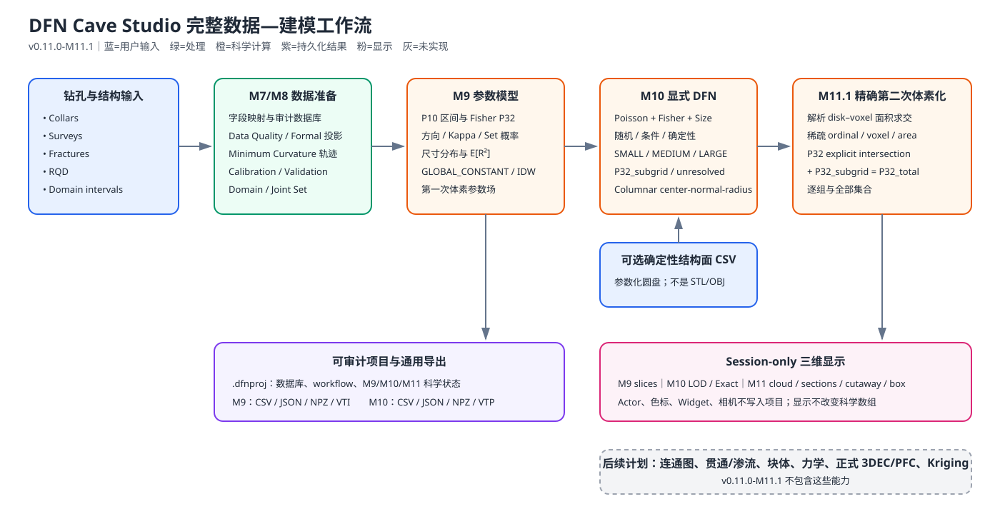
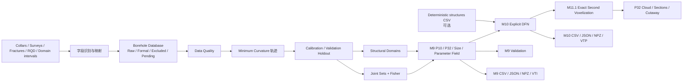
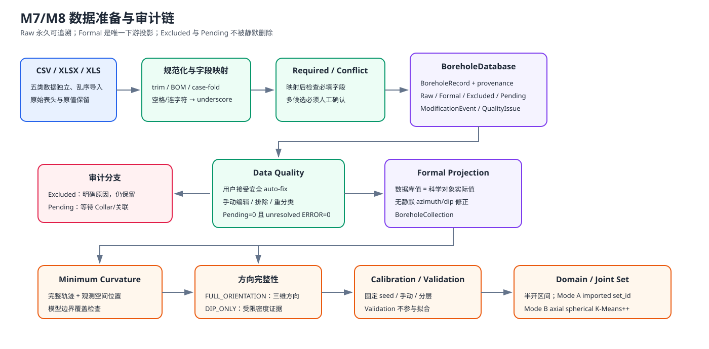
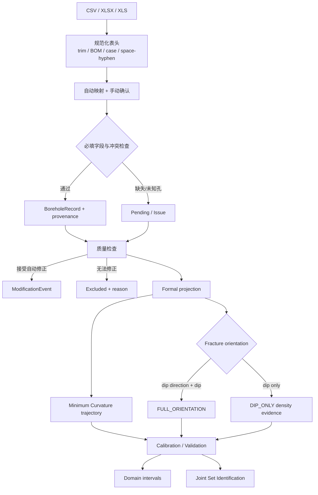
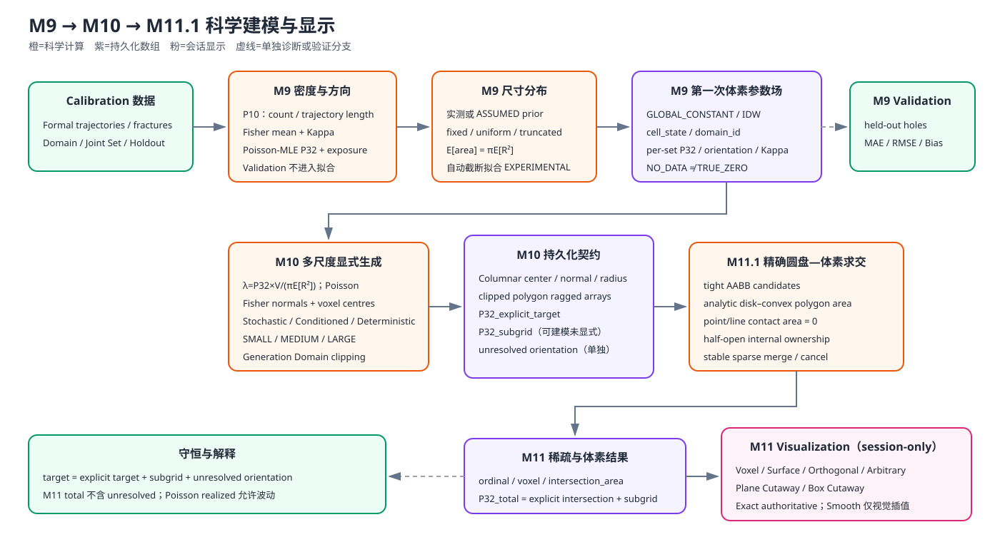
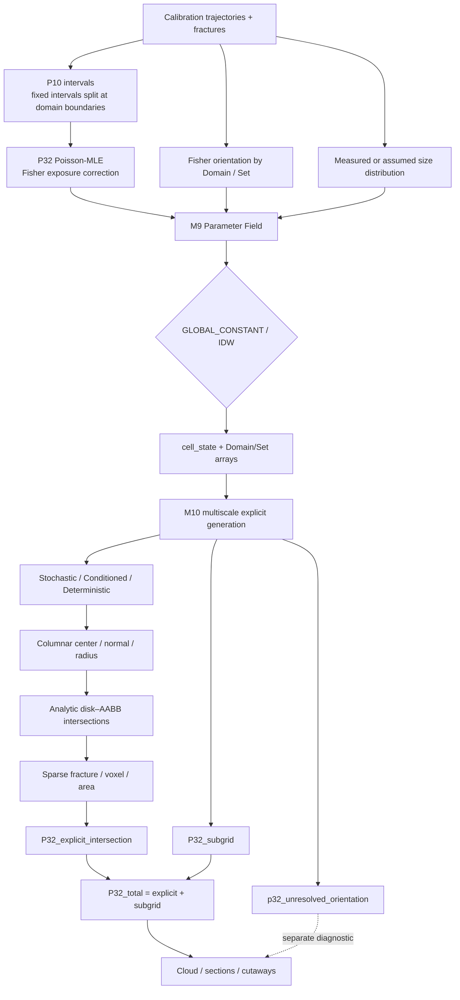

# DFN Cave Studio 数据处理流程（v0.11.0-M11.1）

本文说明数据从原始钻孔文件到 M11.1 精确第二次体素化结果的真实处理链。界面控件使用英文原名；详细字段见 [数据字典与术语](DATA_DICTIONARY_AND_GLOSSARY.md)，逐步操作见 [中文使用说明书](USER_MANUAL.md)。

## 1. 总体流程





## 2. M7/M8 数据准备





### 2.1 原始输入与字段识别

- **输入**：五类 CSV/XLSX/XLS，可分批、乱序、重复导入。
- **规则**：表头去除首尾空格和 BOM、忽略大小写、空格/连字符转下划线；Required 判断在映射后执行。
- **输出与存储**：每行成为 BoreholeRecord，保存 `original_values`、`values`、source file/row、原始/规范化表头、mapping、record/batch ID 和时间。
- **下一步**：进入质量分类；缺 Collar 的关联记录进入 Pending，不被删除。
- **假设**：文件已采用统一坐标参考、m 和 degree；软件不自动换投影或单位。

### 2.2 数据质量与 Formal 投影

- **输入**：BoreholeDatabase 的所有审计记录。
- **检查**：Collar 必填/坐标/终孔深度；Survey 深度、重复站、azimuth/dip；Fracture 深度、方向、dip、set_id；RQD 值域和重叠；Domain 区间和重叠；未知孔引用。
- **自动建议**：Survey azimuth `%360`、Survey dip clamp 到 `[-90,90]`、Fracture direction `360→0`；必须由用户接受。
- **输出**：Raw 始终保留；Formal 供计算；Excluded 保存原因；Pending 等待关联；修改写 ModificationEvent。
- **完成条件**：Pending=0 且 unresolved ERROR=0。已确认且有原因的 Excluded 是处理结果，不阻止完成。
- **下游**：`project.borehole_collection` 只是 Formal 记录的计算投影，不是第二份原始数据源。

### 2.3 轨迹、方向完整性和留出

- **轨迹输入**：Collar 和按 measured depth 排序的 Survey stations。
- **算法**：Minimum Curvature；缺 0 m 站时用 Collar 方位补起点，末站不足终孔深度时沿末站方向延伸。
- **Fracture 空间位置**：用测深投影到完整轨迹；越过终孔深度的记录不能进入 Formal。
- **方向分级**：Full orientation 可构造三维法向；Dip-only 不伪造 dip direction，只保留为允许的密度证据。
- **Holdout**：Calibration 参与拟合；Validation 只用于独立评价。划分需锁定。

### 2.4 Domain 与 Joint Set

- **Domain**：钻孔测深区间采用内部半开边界；同一裂隙只归属一个域。
- **Mode A**：使用导入的 `set_id`。
- **Mode B**：Calibration Full orientation 的轴向球面 K-Means++；固定 seed，轴向等价 `n ≡ −n`，空簇确定性修复，结果按平均 dip direction 稳定编号。
- **不足条件**：有效样本或不同轴向方向少于 K 时拒绝，不创建 Count=0 假组。

## 3. M8 空间范围

- **Voxel Analysis Domain**：M9/M11 体素分析范围。Automatic 使用完整轨迹及有效观测点外包；Manual 由用户输入。
- **DFN Generation Domain**：M10 允许生成的更大范围，必须包含 Analysis Domain，并可设置 buffer。
- **Voxel grid**：`nx,ny,nz = ceil(extent / dx,dy,dz)`，保证完整覆盖。边界和 voxel confirmation 是两个独立 workflow 步骤。
- **Cell state**：OUTSIDE_MODEL、NO_DATA、TRUE_ZERO、MODELED_VALUE、EXCAVATION 必须分开保存；不能把空值填 0。

## 4. M9–M11 建模流程





### 4.1 P10 区间

- **输入**：Formal Fracture、完整轨迹、Domain intervals、Calibration/Validation role。
- **规则**：Fixed length 区间在 Domain 边界处分割；一个输出区间只属于一个 Domain；公共边界只计一次；分割前后有效长度守恒。
- **算法**：`P10 = fracture_count / physical_trajectory_length`。
- **输出**：按孔/域/组/role 的 P10Interval，保存计数、长度、中心位置和是否因域边界分割的 provenance。
- **用途**：Calibration 区间用于 P32 密度估计和空间场；Validation 区间仅用于验证。

### 4.2 Fisher 方向模型与方向修正 P32

- **输入**：每个 Domain/Set 的 Calibration Full orientation 法向量；Dip-only 可提供计数但不拟合法向。
- **Fisher**：保存平均 dip direction、mean dip、Kappa；样本不足时明确方向模型不可用。
- **P32**：Poisson-MLE 使用实际轨迹方向与 Fisher 分布的期望曝光 `E(|n·u|)` 修正采样长度；Monte Carlo 使用固定 seed。
- **状态**：低曝光为 LOW_OBSERVABILITY，方向不足为 INSUFFICIENT_ORIENTATION_DATA，不输出伪稳定值。
- **禁止**：不从 RQD 或 aperture 推导 P32。

### 4.3 裂隙尺寸分布

- **输入**：真实 radius/diameter/trace_length/mapped_length，或用户明确的 prior。
- **模型**：fixed、uniform、truncated_lognormal、truncated_power_law、truncated_exponential。
- **面积矩**：生成使用 `E[R²]`，圆盘期望面积为 `πE[R²]`。
- **来源**：无真实尺寸时必须标为 ASSUMED/USER_DEFINED；当前自动截断拟合标为 EXPERIMENTAL，并保存收敛信息。

### 4.4 第一次体素参数场

- **输入**：P32 estimates、Fisher 模型、size models、Domain 和 voxel grid。
- **GLOBAL_CONSTANT**：在已标注 Domain 内应用对应常量。
- **IDW**：按各向异性距离、搜索半径和邻居数插值；Domain-isolated；fallback 关闭且无邻居时为 NO_DATA。
- **输出**：每体素 cell_state、domain_id、各 Set P32/方向/Kappa/概率及 metadata。M9 使用中心赋值，是生成参数场，不是显式几何相交结果。
- **Validation**：留出孔只评价，不回流拟合。

### 4.5 M10 多尺度显式 DFN

对每个可建模 voxel/Domain/Set：

```text
目标裂隙面积 = P32_target × V
E[裂隙面积] = πE[R²]
λ_total = P32_target × V / (πE[R²])
N ~ Poisson(λ)
```

- **方向**：Fisher；无可靠方向时不生成，预算进入 `p32_unresolved_orientation`。
- **中心**：在对应体素内批量均匀采样；Conditioned fracture 经过 Calibration 观测点。
- **尺寸**：按 SMALL/MEDIUM/LARGE 的条件分布直接抽样，不是先生成再丢弃。
- **Subgrid**：未启用显式生成的可建模类别进入逐体素逐组 `P32_subgrid`。
- **来源**：Stochastic、Conditioned observation、Deterministic structure 均显式标记；确定性结构面默认保留真实 `set_id`。
- **边界**：圆盘在 Generation Domain 内保留；相交时真实裁剪；完全域外默认不进入模型统计/显示，但原始导入记录保留。
- **存储**：columnar `center, normal, radius` 等 NumPy 数组；只为裁剪裂隙保存 ragged polygon。stable fracture ID 由 realization 与 ordinal 恢复。
- **预算诊断**：

```text
P32_target = P32_explicit_target + P32_subgrid + P32_unresolved_orientation
```

这是目标/期望守恒；单次 Poisson realized P32 允许波动。

### 4.6 M11.1 精确第二次体素化

- **输入**：M10 参数化圆盘、M9 voxel edges/cell_state、P32_subgrid。
- **候选**：圆盘 tight AABB 只用于筛选；最终面积由解析圆盘—凸多边形/体素求交核计算。
- **接触语义**：点或线接触面积为 0；内部共享面半开所有权，外边界包含，避免重复面积。
- **稀疏输出**：`fracture_ordinal, voxel_flat_index, intersection_area`，以及各 Set 与 aggregate 数组。
- **局部结果**：

```text
P32_explicit_intersection = Σ intersection_area / voxel_volume
P32_total = P32_explicit_intersection + P32_subgrid
```

`p32_unresolved_orientation` 是单独诊断，不进入 total。M11.1 的结果才是当前版本中由显式几何真实交叉回算的局部 P32。

## 5. 算法与规则总表

| 环节 | 当前实现 | 关键参数/约束 | 结果用途 |
|---|---|---|---|
| 轨迹 | Minimum Curvature | Survey MD、azimuth、dip；m/degree | 观测定位、边界检查、P10 长度 |
| Joint Set | Mode A set_id；Mode B axial spherical K-Means++ | K、seed；Full orientation only | Domain/Set 方向统计 |
| Fisher | 法向量平均方向与 Kappa | 每 Domain/Set；至少足够样本 | P32 曝光、M10 方向采样 |
| Dip-only | 保留 dip，不补 dip direction | 可作为有 set_id 的密度证据 | 不参与 3D 方向拟合/条件化 |
| P10 | count / trajectory length | 区间在 Domain 边界分割 | 线密度与验证 |
| P32 | Poisson-MLE + Fisher 曝光 | Calibration only、seeded MC | M9 输入密度 |
| Size | 实测或显式 prior | 使用 E[R²]；自动截断拟合 Experimental | M10 数量与半径 |
| IDW | 域内各向异性反距离加权 | power/radius/neighbours/scales/fallback | M9 空间参数场 |
| 多尺度阈值 | 面积加权 CDF 或手动半径 | SMALL/MEDIUM/LARGE | 显式/亚网格分配 |
| M10 Poisson | `λ=P32V/(πE[R²])` | voxel/Domain/Set 独立 | 显式裂隙数量 |
| Conditioned | 穿过 Calibration Full orientation 观测点 | 可扣减随机预算 | 观测约束几何 |
| Deterministic | 参数化输入圆盘 | 域内/相交/域外分类 | 大型结构面 |
| M10 clipping | Generation Domain 几何裁剪 | 中心+法向+半径，ragged clipped polygon | 保存/显示/导出 |
| M11 intersection | 解析 disk–AABB 面积 | half-open ownership、tolerance | 稀疏真实面积 |
| M11 P32 | 面积和/体素体积 | explicit + subgrid；unresolved separate | 第二次体素结果 |
| 持久化 | `.dfnproj` ZIP/数组 | source/config hash、依赖失效 | 保存重开与审计 |

## 6. 状态、显示与存储边界

| 名称 | 科学含义 | 是否生成显示几何 | 是否保存 |
|---|---|---:|---:|
| MODELED_VALUE | 有模型值 | 是 | 是 |
| TRUE_ZERO | 有证据的零值 | 是，颜色对应 0 | 是 |
| NO_DATA | 信息不足 | 否 | 是 |
| OUTSIDE_MODEL | 模型外 | 否 | 是 |
| EXCAVATION | 开挖/Mask 排除 | 否 | 是 |
| P32_subgrid | 可建模但未显式生成的小尺度目标 | 可按字段显示 | 是 |
| p32_unresolved_orientation | 缺方向而未生成的预算 | 单独诊断，不混入 total | 是 |

Exact Cell Colours 直接显示 cell scalars。Smooth Display 仅在已过滤的有效体素内构造 point scalars；不会跨 NO_DATA 孔洞，也不会写回科学数组。Outer Surface、Section、Cutaway、Box Cutaway 和所有图层/色标/Widget 都是 session-only。

## 7. 导出和审计

- **数据库质量**：JSON、CSV 报告。
- **M9**：P10/P32 CSV，density/size/validation JSON/CSV，parameter field NPZ/VTI。
- **M10**：fractures/conditioned/deterministic CSV，summary JSON/CSV，geometry NPZ，VTP。
- **M11.1**：科学结果随 `.dfnproj` 保存/重开；当前没有独立 M11 文件导出按钮。
- **未实现**：正式 3DEC/PFC、连通图、渗流、块度、Kriging。

不要把截图、Smooth cloud 或 VTP 显示网格当作新的科学估计。任何解释都应同时报告输入来源、Calibration/Validation 划分、seed、Domain/Set、尺寸来源、cell state 和守恒诊断。
